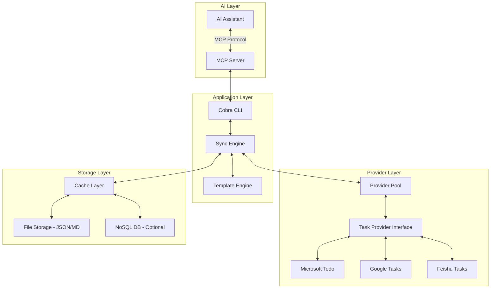
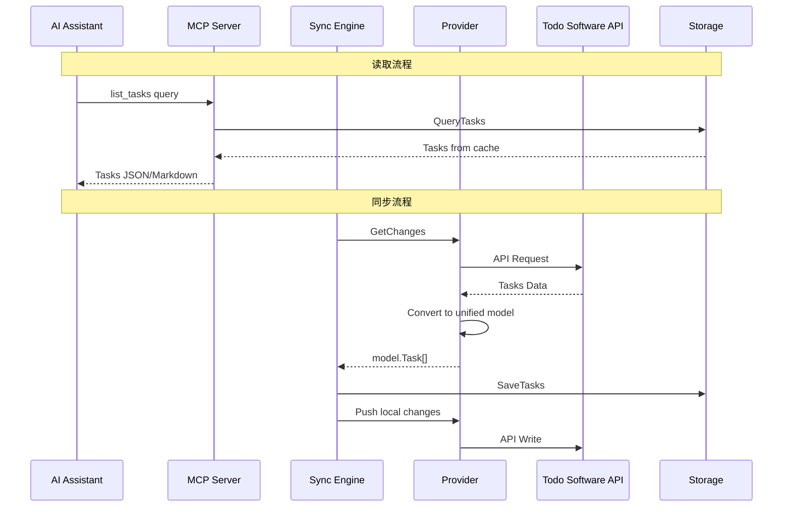

# TaskBridge MCP 架构设计

## 项目概述

TaskBridge 是一个 MCP (Model Context Protocol) 工具，旨在连接各种 Todo 软件与 AI，让 AI 能够：

- 理解用户的任务和计划
- 为用户提供更智能的计划建议
- 为不支持高级功能的 Todo 软件提供增强功能（4象限、优先级、可视化等）

## 核心设计理念

1. **统一抽象** - 用一套统一的数据模型表示不同 Todo 软件的任务
2. **双向同步** - 支持从 Todo 软件读取和反向写入
3. **元数据嵌入** - 将高级功能所需的元数据嵌入到各软件的备注/描述字段
4. **AI 友好** - 输出 JSON/Markdown 格式，方便 AI 读取和理解
5. **灵活部署** - 支持后台服务和单次命令两种模式

---

## 整体架构



---

## 目录结构

```
taskbridge-mcp/
├── cmd/
│   ├── root.go              # Cobra 根命令
│   ├── serve.go             # 后台服务模式命令
│   ├── sync.go              # 单次同步命令
│   ├── list.go              # 列出任务命令
│   └── config.go            # 配置管理命令
├── internal/
│   ├── provider/            # Todo 软件适配器
│   │   ├── provider.go      # Provider 接口定义
│   │   ├── registry.go      # Provider 注册中心
│   │   ├── base.go          # 基础实现，提供通用方法
│   │   ├── microsoft/       # 微软 Todo 适配器
│   │   ├── google/          # Google Tasks 适配器
│   │   ├── feishu/          # 飞书任务适配器
│   │   ├── ticktick/        # TickTick 适配器
│   │   ├── todoist/         # Todoist 适配器
│   │   ├── omnifocus/       # OmniFocus 适配器 (macOS)
│   │   ├── apple/           # Apple Reminders 适配器
│   │   └── local/           # 本地文件适配器
│   ├── model/               # 核心数据模型
│   │   ├── task.go          # 统一任务模型
│   │   ├── quadrant.go      # 四象限模型
│   │   ├── priority.go      # 优先级定义
│   │   └── metadata.go      # 元数据结构
│   ├── storage/             # 存储层
│   │   ├── storage.go       # 存储接口
│   │   ├── filestore/       # 文件存储
│   │   └── nosql/           # NoSQL 存储
│   ├── sync/                # 同步引擎
│   │   ├── engine.go        # 同步引擎核心
│   │   ├── scheduler.go     # 定时调度器
│   │   └── conflict.go      # 冲突解决
│   ├── template/            # 模板引擎
│   │   ├── renderer.go      # 模板渲染器
│   │   └── templates/       # 内置模板
│   └── mcp/                 # MCP 服务
│       ├── server.go        # MCP 服务器
│       ├── tools.go         # MCP Tools 定义
│       └── resources.go     # MCP Resources 定义
├── pkg/
│   ├── config/              # 配置管理 - Viper
│   └── logger/              # 日志管理
├── configs/
│   └── config.yaml          # 默认配置文件
├── templates/
│   ├── json/                # JSON 输出模板
│   └── markdown/            # Markdown 输出模板
└── main.go
```

---

## 核心数据结构

### 统一任务模型 - Task

```go
// internal/model/task.go
package model

import (
    "time"
)

// Task 统一任务模型 - 抽象所有 Todo 软件的任务
type Task struct {
    // 基础字段
    ID           string            `json:"id"`
    Title        string            `json:"title"`
    Description  string            `json:"description,omitempty"`
    Status       TaskStatus        `json:"status"`
    CreatedAt    time.Time         `json:"created_at"`
    UpdatedAt    time.Time         `json:"updated_at"`
    CompletedAt  *time.Time        `json:"completed_at,omitempty"`

    // 时间管理
    DueDate      *time.Time        `json:"due_date,omitempty"`
    StartDate    *time.Time        `json:"start_date,omitempty"`
    Reminder     *time.Time        `json:"reminder,omitempty"`

    // 分类与组织
    ListID       string            `json:"list_id,omitempty"`
    ListName     string            `json:"list_name,omitempty"`
    Tags         []string          `json:"tags,omitempty"`
    Categories   []string          `json:"categories,omitempty"`

    // 高级功能 - 四象限
    Quadrant     Quadrant          `json:"quadrant"`
    Urgency      UrgencyLevel      `json:"urgency"`
    Importance   ImportanceLevel   `json:"importance"`

    // 优先级
    Priority     Priority          `json:"priority"`
    PriorityScore int              `json:"priority_score"` // AI 计算的优先级分数

    // 进度与估算
    Progress     int               `json:"progress"` // 0-100
    EstimatedMinutes int           `json:"estimated_minutes,omitempty"`
    ActualMinutes    int           `json:"actual_minutes,omitempty"`

    // 层级关系
    ParentID     *string           `json:"parent_id,omitempty"`
    SubtaskIDs   []string          `json:"subtask_ids,omitempty"`

    // 元数据 - 用于存储扩展信息
    Metadata     *TaskMetadata     `json:"metadata,omitempty"`

    // 来源信息
    Source       TaskSource        `json:"source"`
    SourceRawID  string            `json:"source_raw_id"` // 原始平台的任务 ID
    ETag         string            `json:"etag,omitempty"` // 用于并发控制
}

// TaskStatus 任务状态
type TaskStatus string

const (
    StatusTodo       TaskStatus = "todo"
    StatusInProgress TaskStatus = "in_progress"
    StatusCompleted  TaskStatus = "completed"
    StatusCancelled  TaskStatus = "cancelled"
    StatusDeferred   TaskStatus = "deferred"
)

// TaskSource 任务来源
type TaskSource string

const (
    SourceMicrosoft TaskSource = "microsoft"
    SourceGoogle    TaskSource = "google"
    SourceFeishu    TaskSource = "feishu"
    SourceTickTick  TaskSource = "ticktick"
    SourceTodoist   TaskSource = "todoist"
    SourceOmniFocus TaskSource = "omnifocus"
    SourceApple     TaskSource = "apple"
    SourceLocal     TaskSource = "local"
)
```

### 四象限模型 - Quadrant

```go
// internal/model/quadrant.go
package model

// Quadrant 四象限 - 艾森豪威尔矩阵
type Quadrant int

const (
    QuadrantUrgentImportant     Quadrant = 1 // 紧急且重要 - 立即做
    QuadrantNotUrgentImportant  Quadrant = 2 // 不紧急但重要 - 计划做
    QuadrantUrgentNotImportant  Quadrant = 3 // 紧急但不重要 - 授权做
    QuadrantNotUrgentNotImportant Quadrant = 4 // 不紧急也不重要 - 删除/延后
)

// UrgencyLevel 紧急程度
type UrgencyLevel int

const (
    UrgencyNone UrgencyLevel = 0
    UrgencyLow  UrgencyLevel = 1
    UrgencyMedium UrgencyLevel = 2
    UrgencyHigh UrgencyLevel = 3
    UrgencyCritical UrgencyLevel = 4
)

// ImportanceLevel 重要程度
type ImportanceLevel int

const (
    ImportanceNone ImportanceLevel = 0
    ImportanceLow  ImportanceLevel = 1
    ImportanceMedium ImportanceLevel = 2
    ImportanceHigh ImportanceLevel = 3
    ImportanceCritical ImportanceLevel = 4
)

// CalculateQuadrant 根据紧急和重要程度计算象限
func CalculateQuadrant(urgency UrgencyLevel, importance ImportanceLevel) Quadrant {
    isUrgent := urgency >= UrgencyMedium
    isImportant := importance >= ImportanceMedium

    switch {
    case isUrgent && isImportant:
        return QuadrantUrgentImportant
    case !isUrgent && isImportant:
        return QuadrantNotUrgentImportant
    case isUrgent && !isImportant:
        return QuadrantUrgentNotImportant
    default:
        return QuadrantNotUrgentNotImportant
    }
}
```

### 优先级模型 - Priority

```go
// internal/model/priority.go
package model

// Priority 优先级
type Priority int

const (
    PriorityNone Priority = 0
    PriorityLow  Priority = 1
    PriorityMedium Priority = 2
    PriorityHigh Priority = 3
    PriorityUrgent Priority = 4
)

// PriorityCalculator 优先级计算器 - AI 可调用
type PriorityCalculator struct {
    WeightDueDate      float64 `json:"weight_due_date"`
    WeightImportance   float64 `json:"weight_importance"`
    WeightUrgency      float64 `json:"weight_urgency"`
    WeightProgress     float64 `json:"weight_progress"`
}

// Calculate 计算综合优先级分数
func (pc *PriorityCalculator) Calculate(task *Task) int {
    score := 0.0
    // 实现优先级计算逻辑
    return int(score)
}
```

### 元数据结构 - TaskMetadata

```go
// internal/model/metadata.go
package model

import (
    "encoding/json"
    "time"
)

// TaskMetadata 任务元数据 - 存储在原始软件的备注/描述中
type TaskMetadata struct {
    // 版本信息
    Version      string `json:"version"`

    // 四象限数据
    Quadrant     int    `json:"quadrant"`
    Urgency      int    `json:"urgency"`
    Importance   int    `json:"importance"`

    // 优先级
    Priority     int    `json:"priority"`
    PriorityScore int   `json:"priority_score"`

    // AI 建议
    AISuggestion string `json:"ai_suggestion,omitempty"`
    AIConfidence float64 `json:"ai_confidence,omitempty"`

    // 时间追踪
    EstimatedMinutes int       `json:"estimated_minutes,omitempty"`
    ActualMinutes    int       `json:"actual_minutes,omitempty"`
    PomodoroCount    int       `json:"pomodoro_count,omitempty"`

    // 自定义字段
    CustomFields map[string]interface{} `json:"custom_fields,omitempty"`

    // 同步信息
    LastSyncAt  time.Time `json:"last_sync_at"`
    SyncSource  string    `json:"sync_source"`
    LocalID     string    `json:"local_id"`
}

// ToJSON 序列化为 JSON 字符串 - 用于嵌入备注
func (m *TaskMetadata) ToJSON() (string, error) {
    data, err := json.Marshal(m)
    if err != nil {
        return "", err
    }
    return string(data), nil
}

// ParseMetadata 从字符串解析元数据
func ParseMetadata(s string) (*TaskMetadata, error) {
    var m TaskMetadata
    err := json.Unmarshal([]byte(s), &m)
    if err != nil {
        return nil, err
    }
    return &m, nil
}

// MetadataMarker 元数据标记 - 用于在备注中识别元数据块
const MetadataMarker = "<!-- TaskBridge-Metadata:"

// EmbedMetadata 将元数据嵌入到描述文本中
func EmbedMetadata(description string, metadata *TaskMetadata) (string, error) {
    jsonStr, err := metadata.ToJSON()
    if err != nil {
        return description, err
    }
    return description + "\n\n" + MetadataMarker + jsonStr + " -->", nil
}

// ExtractMetadata 从描述文本中提取元数据
func ExtractMetadata(description string) (string, *TaskMetadata, error) {
    // 实现提取逻辑
    return description, nil, nil
}
```

---

## Provider 接口设计

```go
// internal/provider/provider.go
package provider

import (
    "context"
    "github.com/yeisme/taskbridge/internal/model"
)

// Provider Todo 软件适配器接口
type Provider interface {
    // 基础信息
    Name() string
    DisplayName() string

    // 认证
    Authenticate(ctx context.Context, config map[string]interface{}) error
    IsAuthenticated() bool
    RefreshToken(ctx context.Context) error

    // 任务列表操作
    ListTaskLists(ctx context.Context) ([]model.TaskList, error)
    CreateTaskList(ctx context.Context, name string) (*model.TaskList, error)
    DeleteTaskList(ctx context.Context, listID string) error

    // 任务操作 - 读取
    ListTasks(ctx context.Context, listID string, opts ListOptions) ([]model.Task, error)
    GetTask(ctx context.Context, listID, taskID string) (*model.Task, error)
    SearchTasks(ctx context.Context, query string) ([]model.Task, error)

    // 任务操作 - 写入
    CreateTask(ctx context.Context, listID string, task *model.Task) (*model.Task, error)
    UpdateTask(ctx context.Context, listID string, task *model.Task) (*model.Task, error)
    DeleteTask(ctx context.Context, listID, taskID string) error

    // 批量操作
    BatchCreate(ctx context.Context, listID string, tasks []*model.Task) ([]model.Task, error)
    BatchUpdate(ctx context.Context, listID string, tasks []*model.Task) ([]model.Task, error)

    // 同步支持
    GetChanges(ctx context.Context, since time.Time) (*SyncChanges, error)

    // 能力查询
    Capabilities() ProviderCapabilities
}

// ListOptions 列表查询选项
type ListOptions struct {
    PageSize      int
    PageToken     string
    Completed     *bool
    DueBefore     *time.Time
    DueAfter      *time.Time
    UpdatedAfter  *time.Time
}

// ProviderCapabilities Provider 能力描述
type ProviderCapabilities struct {
    SupportsSubtasks   bool `json:"supports_subtasks"`
    SupportsTags       bool `json:"supports_tags"`
    SupportsCategories bool `json:"supports_categories"`
    SupportsReminder   bool `json:"supports_reminder"`
    SupportsDueDate    bool `json:"supports_due_date"`
    SupportsStartDate  bool `json:"supports_start_date"`
    SupportsProgress   bool `json:"supports_progress"`
    SupportsPriority   bool `json:"supports_priority"`
    SupportsSearch     bool `json:"supports_search"`
    SupportsBatch      bool `json:"supports_batch"`
    SupportsDeltaSync  bool `json:"supports_delta_sync"`
    MaxTaskLength      int  `json:"max_task_length"`
    MaxDescriptionLength int `json:"max_description_length"`
}

// SyncChanges 同步变更
type SyncChanges struct {
    Tasks       []model.Task `json:"tasks"`
    DeletedIDs  []string     `json:"deleted_ids"`
    NextToken   string       `json:"next_token"`
    HasMore     bool         `json:"has_more"`
}
```

---

## Provider 详细实现

### Provider 能力对比表

| Provider        | 子任务 | 标签 | 优先级 | 截止日期 | 提醒 | 进度 | 增量同步 | 备注       |
| --------------- | ------ | ---- | ------ | -------- | ---- | ---- | -------- | ---------- |
| Microsoft Todo  | ✅     | ✅   | ✅     | ✅       | ✅   | ❌   | ✅       | 完整支持   |
| Google Tasks    | ✅     | ❌   | ❌     | ✅       | ❌   | ❌   | ❌       | 基础支持   |
| 飞书任务        | ✅     | ✅   | ✅     | ✅       | ✅   | ✅   | ✅       | 完整支持   |
| TickTick        | ✅     | ✅   | ✅     | ✅       | ✅   | ✅   | ❌       | 完整支持   |
| Todoist         | ✅     | ✅   | ✅     | ✅       | ✅   | ❌   | ✅       | 完整支持   |
| OmniFocus       | ✅     | ✅   | ✅     | ✅       | ✅   | ✅   | ❌       | macOS 专用 |
| Apple Reminders | ✅     | ✅   | ✅     | ✅       | ✅   | ❌   | ❌       | macOS/iOS  |

```go

    databaseID string
}

    TitleField       string `json:"title_field"`        // 标题字段名
    StatusField      string `json:"status_field"`       // 状态字段名
    DueDateField     string `json:"due_date_field"`     // 截止日期字段名
    PriorityField    string `json:"priority_field"`     // 优先级字段名
    TagsField        string `json:"tags_field"`         // 标签字段名
    QuadrantField    string `json:"quadrant_field"`     // 象限字段名（自定义）
    ProgressField    string `json:"progress_field"`     // 进度字段名（自定义）
    MetadataField    string `json:"metadata_field"`     // 元数据字段名
}

// 1. 使用数据库概念，每个数据库可以有不同的属性
// 2. 支持丰富的属性类型：select, multi_select, date, number, checkbox等
// 3. 元数据可以存储在隐藏的 rich_text 字段中
// 4. 支持关联数据库，可以实现子任务
```

### TickTick Provider 设计

```go
// internal/provider/ticktick/provider.go
package ticktick

// TickTickProvider TickTick 适配器
type TickTickProvider struct {
    client   *ticktick.Client
    username string
    password string
}

// TickTick API 特点：
// 1. 非官方 API，需要逆向工程
// 2. 支持完整的任务管理功能
// 3. 支持习惯打卡、番茄钟等功能
// 4. 原生支持四象限视图
// 5. 优先级：0（无）、1（低）、2（中）、3（高）、5（紧急）

// TickTickPriority 原生优先级映射
var TickTickPriorityMap = map[int]model.Priority{
    0: model.PriorityNone,
    1: model.PriorityLow,
    2: model.PriorityMedium,
    3: model.PriorityHigh,
    5: model.PriorityUrgent,
}
```

### Todoist Provider 设计

```go
// internal/provider/todoist/provider.go
package todoist

// TodoistProvider Todoist 适配器
type TodoistProvider struct {
    client *todoist.Client
    token  string
}

// Todoist API 特点：
// 1. 官方 REST API，文档完善
// 2. 支持项目、部分、任务三级结构
// 3. 优先级：1（普通）、2（高）、3（更高）、4（紧急）
// 4. 支持标签、过滤器
// 5. 支持 Karma 积分系统

// TodoistPriority 原生优先级映射
var TodoistPriorityMap = map[int]model.Priority{
    1: model.PriorityNone,
    2: model.PriorityMedium,
    3: model.PriorityHigh,
    4: model.PriorityUrgent,
}
```

### OmniFocus Provider 设计

```go
// internal/provider/omnifocus/provider.go
package omnifocus

// OmniFocusProvider OmniFocus 适配器 - 仅 macOS
type OmniFocusProvider struct {
    transport  TransportType
    applescript *AppleScriptRunner
}

type TransportType string

const (
    TransportAppleScript TransportType = "applescript"
    TransportURLScheme   TransportType = "url_scheme"
)

// OmniFocus 特点：
// 1. 仅 macOS/iOS 可用
// 2. 通过 AppleScript 或 URL Scheme 操作
// 3. 支持透视（Perspective）功能
// 4. 原生支持 GTD 方法论
// 5. 支持审查（Review）功能

// AppleScript 示例：获取所有任务
const scriptGetTasks = `
tell application "OmniFocus"
    tell front document
        get properties of every task
    end tell
end tell
`
```

### Apple Reminders Provider 设计

```go
// internal/provider/apple/provider.go
package apple

// AppleProvider Apple Reminders 适配器 - 仅 macOS/iOS
type AppleProvider struct {
    transport  TransportType
    lists      []string // 要同步的列表
}

// Apple Reminders 特点：
// 1. 通过 AppleScript 或 EventKit 操作
// 2. 支持列表、任务两级结构
// 3. 支持子任务
// 4. 支持基于位置的提醒
// 5. iCloud 同步

// 使用 EventKit（CGO）或 AppleScript
// EventKit 性能更好，但需要 CGO
// AppleScript 更简单，但性能较差
```

---

## 存储层设计

```go
// internal/storage/storage.go
package storage

import (
    "context"
    "github.com/yeisme/taskbridge/internal/model"
)

// Storage 存储接口
type Storage interface {
    // 任务存储
    SaveTask(ctx context.Context, task *model.Task) error
    GetTask(ctx context.Context, id string) (*model.Task, error)
    ListTasks(ctx context.Context, opts ListOptions) ([]model.Task, error)
    DeleteTask(ctx context.Context, id string) error

    // 批量操作
    SaveTasks(ctx context.Context, tasks []*model.Task) error

    // 查询
    QueryTasks(ctx context.Context, query Query) ([]model.Task, error)

    // 导出
    ExportToJSON(ctx context.Context, opts ExportOptions) ([]byte, error)
    ExportToMarkdown(ctx context.Context, opts ExportOptions) ([]byte, error)
}

// Query 查询条件
type Query struct {
    Sources    []model.TaskSource
    Statuses   []model.TaskStatus
    Quadrants  []model.Quadrant
    Priorities []model.Priority
    Tags       []string
    DueBefore  *time.Time
    DueAfter   *time.Time
    FullText   string
}

// ExportOptions 导出选项
type ExportOptions struct {
    Format       string // json, markdown
    Template     string // 自定义模板路径
    IncludeMeta  bool   // 是否包含元数据
    Pretty       bool   // 是否格式化输出
}
```

---

## 同步引擎设计

```go
// internal/sync/engine.go
package sync

import (
    "context"
    "time"
)

// SyncEngine 同步引擎
type SyncEngine struct {
    providers  map[string]provider.Provider
    storage    storage.Storage
    scheduler  *Scheduler
    config     *SyncConfig
}

// SyncConfig 同步配置
type SyncConfig struct {
    Mode          SyncMode       `mapstructure:"mode"`
    Interval      time.Duration  `mapstructure:"interval"`
    ConflictRes   ConflictPolicy `mapstructure:"conflict_resolution"`
    RetryCount    int            `mapstructure:"retry_count"`
    RetryDelay    time.Duration  `mapstructure:"retry_delay"`
}

// SyncMode 同步模式
type SyncMode string

const (
    SyncModeOnce     SyncMode = "once"     // 单次同步
    SyncModeInterval SyncMode = "interval" // 定时同步
    SyncModeRealtime SyncMode = "realtime" // 实时同步 - 如果支持
)

// ConflictPolicy 冲突解决策略
type ConflictPolicy string

const (
    ConflictLocalWins  ConflictPolicy = "local_wins"
    ConflictRemoteWins ConflictPolicy = "remote_wins"
    ConflictNewerWins  ConflictPolicy = "newer_wins"
    ConflictManual     ConflictPolicy = "manual"
)

// SyncResult 同步结果
type SyncResult struct {
    Pulled      int            `json:"pulled"`
    Pushed      int            `json:"pushed"`
    Updated     int            `json:"updated"`
    Deleted     int            `json:"deleted"`
    Conflicts   []Conflict     `json:"conflicts"`
    Errors      []SyncError    `json:"errors"`
    Duration    time.Duration  `json:"duration"`
}

// Run 执行同步
func (e *SyncEngine) Run(ctx context.Context) (*SyncResult, error) {
    // 实现同步逻辑
    return nil, nil
}
```

---

## MCP 服务设计

```go
// internal/mcp/server.go
package mcp

import (
    "github.com/modelcontextprotocol/go-sdk/pkg/server"
)

// MCPServer MCP 服务器
type MCPServer struct {
    server    *server.Server
    sync      *sync.SyncEngine
    storage   storage.Storage
}

// NewMCPServer 创建 MCP 服务器
func NewMCPServer(cfg *Config) (*MCPServer, error) {
    return nil, nil
}

// Start 启动 MCP 服务
func (s *MCPServer) Start(ctx context.Context) error {
    return nil
}
```

### MCP Tools 定义

```go
// internal/mcp/tools.go
package mcp

// MCP Tools - AI 可调用的工具

// Tool: taskbridge_list_tasks
// 列出所有任务，支持筛选
type ListTasksInput struct {
    Source    string `json:"source,omitempty"`    // microsoft, google, feishu, all
    Status    string `json:"status,omitempty"`    // todo, completed, all
    Quadrant  int    `json:"quadrant,omitempty"`  // 1-4
    Priority  int    `json:"priority,omitempty"`  // 0-4
    DueBefore string `json:"due_before,omitempty"`
    DueAfter  string `json:"due_after,omitempty"`
}

type ListTasksOutput struct {
    Tasks  []model.Task `json:"tasks"`
    Total  int          `json:"total"`
}

// Tool: taskbridge_get_task
// 获取单个任务详情
type GetTaskInput struct {
    TaskID string `json:"task_id"`
}

type GetTaskOutput struct {
    Task model.Task `json:"task"`
}

// Tool: taskbridge_create_task
// 创建新任务
type CreateTaskInput struct {
    Title       string `json:"title"`
    Description string `json:"description,omitempty"`
    DueDate     string `json:"due_date,omitempty"`
    Quadrant    int    `json:"quadrant,omitempty"`
    Priority    int    `json:"priority,omitempty"`
    Source      string `json:"source"` // 目标平台
    ListID      string `json:"list_id,omitempty"`
}

type CreateTaskOutput struct {
    Task model.Task `json:"task"`
}

// Tool: taskbridge_update_task
// 更新任务
type UpdateTaskInput struct {
    TaskID      string `json:"task_id"`
    Title       string `json:"title,omitempty"`
    Description string `json:"description,omitempty"`
    Status      string `json:"status,omitempty"`
    Quadrant    int    `json:"quadrant,omitempty"`
    Priority    int    `json:"priority,omitempty"`
}

type UpdateTaskOutput struct {
    Task model.Task `json:"task"`
}

// Tool: taskbridge_analyze_tasks
// AI 分析任务，提供优化建议
type AnalyzeTasksInput struct {
    AnalysisType string `json:"analysis_type"` // quadrant, priority, schedule
    TaskIDs      []string `json:"task_ids,omitempty"`
}

type AnalyzeTasksOutput struct {
    Analysis   string      `json:"analysis"`
    Suggestions []string   `json:"suggestions"`
    Data       interface{} `json:"data"`
}

// Tool: taskbridge_sync
// 触发同步
type SyncInput struct {
    Source string `json:"source,omitempty"` // 指定同步源，空为全部
    Mode   string `json:"mode"`             // pull, push, bidirectional
}

type SyncOutput struct {
    Result sync.SyncResult `json:"result"`
}
```

---

## CLI 命令设计

使用 Cobra 实现：

```
taskbridge [command] [flags]

Commands:
  serve       启动后台服务（MCP服务 + 定时同步）
  sync        执行单次同步
  list        列出任务
  get         获取任务详情
  create      创建任务
  update      更新任务
  delete      删除任务
  analyze     分析任务（生成四象限视图等）
  config      配置管理
  provider    Provider 管理

Flags:
  --config, -c    配置文件路径
  --format, -f    输出格式 (json, markdown, table)
  --source, -s    指定数据源
  --verbose, -v   详细输出
```

---

## 配置设计

使用 Viper 管理配置：

```yaml
# configs/config.yaml
# TaskBridge 配置文件

# 应用配置
app:
  name: taskbridge
  version: 1.0.0
  log_level: info

# 存储配置
storage:
  type: file # file, mongodb
  path: ./data

  # 文件存储配置
  file:
    format: json # json, markdown
    template: "" # 自定义模板路径

  # NoSQL 配置（可选）
  nosql:
    url: mongodb://localhost:27017/taskbridge
    database: taskbridge
    collection: tasks

# 同步配置
sync:
  mode: interval # once, interval, realtime
  interval: 5m
  conflict_resolution: newer_wins # local_wins, remote_wins, newer_wins, manual
  retry_count: 3
  retry_delay: 1s

# MCP 服务配置
mcp:
  enabled: true
  transport: stdio # stdio, tcp
  port: 8080 # TCP 模式端口

# Provider 配置
providers:
  microsoft:
    enabled: true
    client_id: ""
    client_secret: ""
    tenant_id: ""

  google:
    enabled: true
    client_id: ""
    client_secret: ""
    credentials_file: ""

  feishu:
    enabled: true
    app_id: ""
    app_secret: ""

    enabled: true
    database_id: "" # 任务数据库 ID

  ticktick:
    enabled: true
    username: ""
    password: ""
    # 或者使用 OAuth
    client_id: ""
    client_secret: ""

  todoist:
    enabled: true
    api_token: "" # Todoist API Token

  omnifocus:
    enabled: false # 仅 macOS 可用
    transport: "apple_script" # apple_script 或 url_scheme

  apple:
    enabled: false # 仅 macOS/iOS 可用
    list_names: [] # 要同步的列表名称，空为全部

# 输出模板配置
templates:
  json:
    path: ./templates/json/default.json
  markdown:
    path: ./templates/markdown/default.md
```

---

## 数据流图



---

## 下一步计划

1. **Phase 1 - 基础框架**
   - 项目初始化（go mod, cobra, viper）
   - 核心数据模型实现
   - 存储层实现（文件存储）

2. **Phase 2 - Provider 实现（核心）**
   - Provider 接口实现
   - Microsoft Todo Provider
   - Google Tasks Provider
   - 飞书 Provider

3. **Phase 3 - Provider 实现（扩展）**
   - TickTick Provider
   - Todoist Provider

4. **Phase 4 - Provider 实现（平台特定）**
   - OmniFocus Provider（macOS）
   - Apple Reminders Provider（macOS/iOS）

5. **Phase 5 - 同步引擎**
   - 同步引擎核心
   - 冲突解决机制
   - 定时调度器

6. **Phase 6 - MCP 服务**
   - MCP Server 实现
   - Tools 定义
   - Resources 定义

7. **Phase 7 - 高级功能**
   - 四象限分析
   - 优先级计算
   - AI 建议生成
   - 可视化输出

---

## 技术栈总结

| 组件          | 技术选型                               |
| ------------- | -------------------------------------- |
| CLI 框架      | Cobra                                  |
| 配置管理      | Viper                                  |
| MCP SDK       | github.com/modelcontextprotocol/go-sdk |
| HTTP 客户端   | net/http + resty                       |
| OAuth         | golang.org/x/oauth2                    |
| 模板引擎      | text/template                          |
| 日志          | zerolog / zap                          |
| NoSQL（可选） | MongoDB                                |
| 测试          | testify                                |
