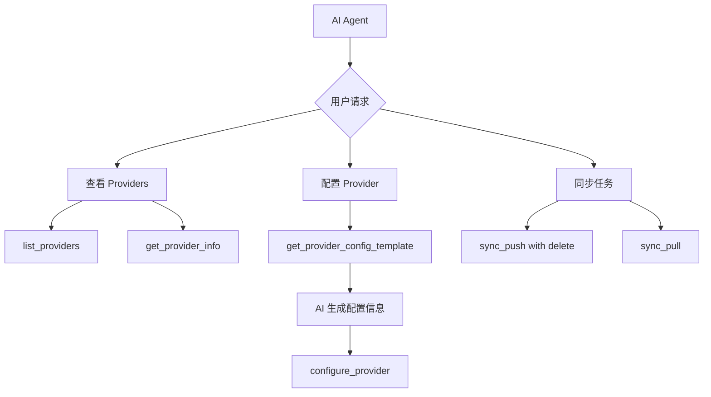

# MCP Provider 集成计划

## 背景

用户希望增强 MCP 服务器的功能，包括：

1. 优化 `provider list` CLI 表格输出对齐和简写展示
2. MCP 集成删除同步功能（支持 `--delete` 选项）
3. MCP 集成 provider 查看功能
4. MCP 支持 AI agent 自动生成 provider 配置信息

## 当前状态分析

### CLI Provider 命令

- [`cmd/provider.go`](cmd/provider.go) 实现了 provider 管理命令
- 表格输出使用硬编码宽度，对齐不佳
- 缺少简写/别名展示

### MCP 服务器

- [`internal/mcp/server.go`](internal/mcp/server.go) 定义了 MCP 工具注册
- [`internal/mcp/handlers.go`](internal/mcp/handlers.go) 实现了工具处理器
- 当前支持：任务管理、分析、项目管理
- 缺少：同步功能、provider 管理

## 实现计划

### 第一阶段：优化 CLI Provider 表格输出

修改 [`cmd/provider.go`](cmd/provider.go)：

```go
// ProviderInfo 添加简写字段
type ProviderInfo struct {
    Name         string
    ShortName    string  // 新增：简写
    DisplayName  string
    Description  string
    AuthType     string
    Enabled      bool
    Connected    bool
    Capabilities []string
}

// 使用 text/tabwriter 实现自动对齐
func runProviderList(cmd *cobra.Command, args []string) {
    // 使用 tabwriter 对齐
    w := tabwriter.NewWriter(os.Stdout, 0, 0, 2, ' ', 0)
    fmt.Fprintln(w, "名称\t简写\t状态\t认证方式\t描述")
    // ...
}
```

输出示例：

```
名称              简写    状态        认证方式         描述
Google Tasks     google  ❌ 未启用    OAuth2          Google 任务管理服务
Microsoft To Do  ms      ❌ 未启用    OAuth2          微软任务管理服务
飞书任务         feishu  ❌ 未启用    App ID/Secret   飞书任务管理
TickTick         tick    ❌ 未启用    User/Pass       TickTick 任务管理
Todoist          todo    ❌ 未启用    API Token       Todoist 任务管理
```

### 第二阶段：MCP 集成同步功能

在 [`internal/mcp/server.go`](internal/mcp/server.go) 添加同步工具：

```go
// registerSyncTools 注册同步工具
func (s *Server) registerSyncTools() {
    // 推送同步（支持删除）
    s.server.AddTool(&mcp.Tool{
        Name:        "sync_push",
        Description: "推送本地任务到远程平台，可选择删除远程多余任务",
        InputSchema: json.RawMessage(`{
            "type": "object",
            "properties": {
                "provider": {"type": "string", "description": "目标平台 (google, microsoft)"},
                "delete": {"type": "boolean", "description": "是否删除远程存在但本地不存在的任务"},
                "dry_run": {"type": "boolean", "description": "模拟执行，不实际修改"}
            },
            "required": ["provider"]
        }`),
    }, s.handleSyncPush)

    // 拉取同步
    s.server.AddTool(&mcp.Tool{
        Name:        "sync_pull",
        Description: "从远程平台拉取任务到本地",
        InputSchema: json.RawMessage(`{
            "type": "object",
            "properties": {
                "provider": {"type": "string", "description": "来源平台"}
            },
            "required": ["provider"]
        }`),
    }, s.handleSyncPull)
}
```

### 第三阶段：MCP 集成 Provider 管理

```go
// registerProviderTools 注册 Provider 管理工具
func (s *Server) registerProviderTools() {
    // 列出 Providers
    s.server.AddTool(&mcp.Tool{
        Name:        "list_providers",
        Description: "列出所有支持的 Provider 及其状态",
        InputSchema: json.RawMessage(`{"type": "object"}`),
    }, s.handleListProviders)

    // 获取 Provider 详情
    s.server.AddTool(&mcp.Tool{
        Name:        "get_provider_info",
        Description: "获取指定 Provider 的详细信息和能力",
        InputSchema: json.RawMessage(`{
            "type": "object",
            "properties": {
                "provider": {"type": "string", "description": "Provider 名称或简写"}
            },
            "required": ["provider"]
        }`),
    }, s.handleGetProviderInfo)

    // 配置 Provider（AI agent 可用）
    s.server.AddTool(&mcp.Tool{
        Name:        "configure_provider",
        Description: "配置 Provider 的认证信息，支持 AI agent 自动填写",
        InputSchema: json.RawMessage(`{
            "type": "object",
            "properties": {
                "provider": {"type": "string", "description": "Provider 名称"},
                "config": {"type": "object", "description": "配置信息"}
            },
            "required": ["provider", "config"]
        }`),
    }, s.handleConfigureProvider)
}
```

### 第四阶段：AI Agent 自动配置支持

为 AI agent 提供配置模板和验证：

```go
// 获取 Provider 配置模板
s.server.AddTool(&mcp.Tool{
    Name:        "get_provider_config_template",
    Description: "获取 Provider 的配置模板，AI agent 可据此生成配置",
    InputSchema: json.RawMessage(`{
        "type": "object",
        "properties": {
            "provider": {"type": "string", "description": "Provider 名称"}
        },
        "required": ["provider"]
    }`),
}, s.handleGetProviderConfigTemplate)

// 返回示例：
// {
//         "database_id": "Optional: 任务数据库 ID"
//     },
//     "todoist": {
//         "api_token": "Required: Todoist API Token"
//     }
// }
```

## 文件修改清单

| 文件                       | 修改内容                   |
| -------------------------- | -------------------------- |
| `cmd/provider.go`          | 优化表格输出，添加简写支持 |
| `internal/mcp/server.go`   | 注册同步和 Provider 工具   |
| `internal/mcp/handlers.go` | 实现新的工具处理器         |

## 工具清单

### 新增 MCP 工具

| 工具名                         | 描述                   |
| ------------------------------ | ---------------------- |
| `sync_push`                    | 推送同步，支持删除选项 |
| `sync_pull`                    | 拉取同步               |
| `list_providers`               | 列出所有 Providers     |
| `get_provider_info`            | 获取 Provider 详情     |
| `configure_provider`           | 配置 Provider          |
| `get_provider_config_template` | 获取配置模板           |

## 流程图


