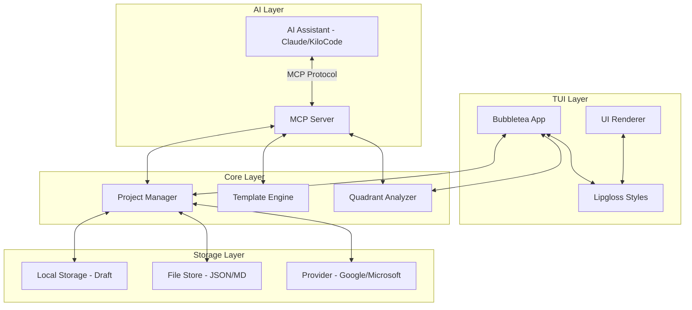
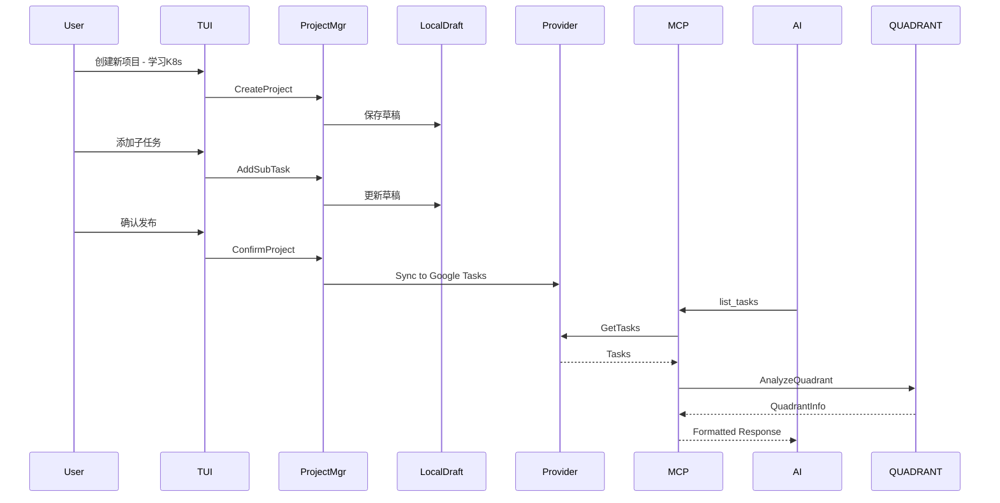
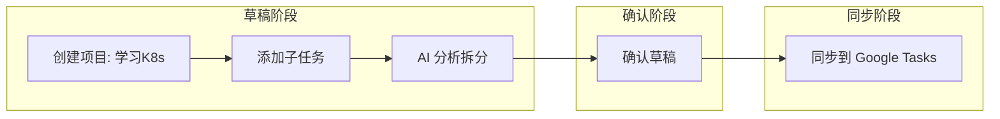

# MCP 与 TUI 集成计划

## 项目目标

1. **集成 MCP 服务** - 实现真正的 MCP 服务器，让 AI 能够通过 MCP 协议访问任务数据
2. **完善模板功能** - 通过 embedded 内置默认 MCP 提示词，说明如何将 Task 转换为四象限信息
3. **项目管理功能** - 支持项目分类、子项目拆分，本地草稿存储
4. **TUI 美化优化** - 使用 lipgloss/bubbletea 替代简单的 fmt.Println

---

## 架构设计

### 整体架构图



### 数据流图



---

## 模块设计

### 1. MCP 服务模块 - internal/mcp/

#### 目录结构

```
internal/mcp/
├── server.go        # MCP 服务器核心实现
├── tools.go         # MCP Tools 定义和实现
├── prompts.go       # Embedded 默认提示词
├── resources.go     # MCP Resources 定义
└── handlers.go      # 工具处理器
```

#### server.go - MCP 服务器

```go
package mcp

import (
    "context"
    "github.com/modelcontextprotocol/go-sdk/server"
)

// Server MCP 服务器
type Server struct {
    server      *server.Server
    taskStore   storage.TaskStorage
    projectMgr  *project.Manager
    tools       *ToolRegistry
}

// NewServer 创建 MCP 服务器
func NewServer(opts ...ServerOption) *Server {
    // 实现...
}

// Start 启动服务
func (s *Server) Start(ctx context.Context, transport string) error {
    // 实现...
}
```

#### prompts.go - Embedded 默认提示词

```go
package mcp

import _ "embed"

//go:embed prompts/quadrant_analysis.md
var quadrantAnalysisPrompt string

//go:embed prompts/task_creation.md
var taskCreationPrompt string

//go:embed prompts/project_planning.md
var projectPlanningPrompt string

// DefaultPrompts 默认提示词集合
var DefaultPrompts = map[string]string{
    "quadrant_analysis": quadrantAnalysisPrompt,
    "task_creation":     taskCreationPrompt,
    "project_planning":  projectPlanningPrompt,
}
```

#### prompts/quadrant_analysis.md

````markdown
# 四象限分析提示词

## 任务转四象限规则

当分析任务时，请根据以下规则将任务分配到艾森豪威尔矩阵的四个象限：

### 判断标准

**紧急程度 Urgency 判断：**

- 已过期或今天截止 → Critical 紧急
- 3天内截止 → High 高
- 1周内截止 → Medium 中
- 超过1周或无截止日期 → Low 低

**重要程度 Importance 判断：**

- 与核心目标直接相关 → Critical 关键
- 影响他人或项目进度 → High 高
- 有价值但可延后 → Medium 中
- 可选或低价值 → Low 低

### 象限分配

| 象限           | 紧急程度  | 重要程度  | 策略     |
| -------------- | --------- | --------- | -------- |
| Q1 - 立即做    | >= Medium | >= Medium | 优先处理 |
| Q2 - 计划做    | < Medium  | >= Medium | 安排时间 |
| Q3 - 授权做    | >= Medium | < Medium  | 委托他人 |
| Q4 - 删除/延后 | < Medium  | < Medium  | 考虑删除 |

### MCP 工具调用示例

分析任务时，调用 analyze_quadrant 工具：

```json
{
  "tool": "analyze_quadrant",
  "arguments": {}
}
```
````

创建任务时，指定象限：

```json
{
  "tool": "create_task",
  "arguments": {
    "title": "完成项目报告",
    "due_date": "2026-02-25",
    "priority": 3,
    "quadrant": 1
  }
}
```

### 2. 项目管理模块

- internal/project/

#### 目录结构

```

internal/project/
├── manager.go # 项目管理器
├── project.go # 项目数据结构
├── draft.go # 草稿存储
└── splitter.go # 子项目拆分器

```

#### project.go - 项目数据结构

```go
package project

import (
    "time"
    "github.com/yeisme/taskbridge/internal/model"
)

// Status 项目状态
type Status string

const (
    StatusDraft     Status = "draft"     // 草稿状态
    StatusConfirmed Status = "confirmed" // 已确认
    StatusSynced    Status = "synced"    // 已同步
    StatusArchived  Status = "archived"  // 已归档
)

// Project 项目结构
type Project struct {
    ID          string        `json:"id"`
    Name        string        `json:"name"`
    Description string        `json:"description"`
    Status      Status        `json:"status"`
    ParentID    *string       `json:"parent_id,omitempty"`
    SubProjects []*Project    `json:"sub_projects,omitempty"`
    Tasks       []*model.Task `json:"tasks,omitempty"`
    Tags        []string      `json:"tags,omitempty"`
    CreatedAt   time.Time     `json:"created_at"`
    UpdatedAt   time.Time     `json:"updated_at"`
    SyncedTo    []string      `json:"synced_to,omitempty"` // 同步目标平台
}

// ToMarkdown 将项目转换为 Markdown 格式
func (p *Project) ToMarkdown() string {
    // 实现...
}

// FromMarkdown 从 Markdown 解析项目
func FromMarkdown(content string) (*Project, error) {
    // 实现...
}
```

#### manager.go - 项目管理器

```go
package project

// Manager 项目管理器
type Manager struct {
    draftStore  DraftStorage
    fileStore   FileStorage
    providers   map[string]provider.Provider
}

// CreateProject 创建新项目（草稿状态）
func (m *Manager) CreateProject(name, description string) (*Project, error) {
    // 实现...
}

// AddTask 添加任务到项目
func (m *Manager) AddTask(projectID string, task *model.Task) error {
    // 实现...
}

// SplitIntoSubProjects 将项目拆分为子项目
func (m *Manager) SplitIntoSubProjects(projectID string, rules SplitRules) error {
    // 实现...
}

// ConfirmProject 确认项目，准备同步
func (m *Manager) ConfirmProject(projectID string) error {
    // 实现...
}

// SyncProject 同步项目到指定平台
func (m *Manager) SyncProject(projectID string, targetProvider string) error {
    // 实现...
}
```

### 3. 模板增强模块 - internal/template/

#### 目录结构

```
internal/template/
├── engine.go        # 模板引擎
├── funcs.go         # 自定义模板函数
├── embedded.go      # Embedded 内置模板
└── renderer.go      # 渲染器
```

#### embedded.go - Embedded 内置模板

```go
package template

import _ "embed"

//go:embed templates/quadrant_report.md
var quadrantReportTemplate string

//go:embed templates/project_plan.md
var projectPlanTemplate string

//go:embed templates/task_list.md
var taskListTemplate string

// EmbeddedTemplates 内置模板映射
var EmbeddedTemplates = map[string]string{
    "quadrant_report": quadrantReportTemplate,
    "project_plan":    projectPlanTemplate,
    "task_list":       taskListTemplate,
}
```

### 4. TUI 美化模块 - internal/tui/

#### 目录结构

```
internal/tui/
├── app.go           # Bubbletea 主应用
├── styles.go        # Lipgloss 样式定义
├── components/      # UI 组件
│   ├── tasklist.go  # 任务列表组件
│   ├── quadrant.go  # 四象限视图组件
│   ├── project.go   # 项目管理组件
│   └── statusbar.go # 状态栏组件
└── views/           # 视图
    ├── main.go      # 主视图
    ├── project.go   # 项目视图
    └── settings.go  # 设置视图
```

#### styles.go - Lipgloss 样式

```go
package tui

import "github.com/charmbracelet/lipgloss"

// 样式定义
var (
    // 标题样式
    TitleStyle = lipgloss.NewStyle().
        Bold(true).
        Foreground(lipgloss.Color("#FAFAFA")).
        Background(lipgloss.Color("#7C3AED")).
        Padding(0, 2).
        MarginBottom(1)

    // 象限样式
    QuadrantStyles = map[int]lipgloss.Style{
        1: lipgloss.NewStyle().Foreground(lipgloss.Color("#EF4444")), // Q1 - 红色
        2: lipgloss.NewStyle().Foreground(lipgloss.Color("#3B82F6")), // Q2 - 蓝色
        3: lipgloss.NewStyle().Foreground(lipgloss.Color("#F59E0B")), // Q3 - 橙色
        4: lipgloss.NewStyle().Foreground(lipgloss.Color("#6B7280")), // Q4 - 灰色
    }

    // 项目卡片样式
    ProjectCardStyle = lipgloss.NewStyle().
        Border(lipgloss.RoundedBorder()).
        BorderForeground(lipgloss.Color("#7C3AED")).
        Padding(1, 2).
        Margin(1)

    // 状态标签样式
    StatusStyles = map[project.Status]lipgloss.Style{
        project.StatusDraft:     lipgloss.NewStyle().Foreground(lipgloss.Color("#9CA3AF")),
        project.StatusConfirmed: lipgloss.NewStyle().Foreground(lipgloss.Color("#10B981")),
        project.StatusSynced:    lipgloss.NewStyle().Foreground(lipgloss.Color("#3B82F6")),
        project.StatusArchived:  lipgloss.NewStyle().Foreground(lipgloss.Color("#6B7280")),
    }
)
```

---

## MCP Tools 定义

### 工具列表

| 工具名称         | 描述         | 参数                                            |
| ---------------- | ------------ | ----------------------------------------------- |
| list_tasks       | 列出所有任务 | source, status, quadrant, project_id            |
| create_task      | 创建新任务   | title, due_date, priority, quadrant, project_id |
| update_task      | 更新任务     | id, title, status, quadrant                     |
| delete_task      | 删除任务     | id                                              |
| analyze_quadrant | 四象限分析   | -                                               |
| analyze_priority | 优先级分析   | -                                               |
| create_project   | 创建项目     | name, description, parent_id                    |
| list_projects    | 列出项目     | status                                          |
| split_project    | 拆分项目     | project_id, rules                               |
| confirm_project  | 确认项目     | project_id                                      |
| sync_project     | 同步项目     | project_id, provider                            |
| get_prompt       | 获取提示词   | prompt_name                                     |

### analyze_quadrant 工具详细定义

```go
// AnalyzeQuadrant 四象限分析工具
func (s *Server) AnalyzeQuadrant(ctx context.Context, args map[string]interface{}) (*QuadrantAnalysis, error) {
    tasks, err := s.taskStore.ListTasks(ctx, storage.ListOptions{})
    if err != nil {
        return nil, err
    }

    analysis := &QuadrantAnalysis{
        GeneratedAt: time.Now(),
    }

    for _, task := range tasks {
        quadrant := model.CalculateQuadrantFromTask(task)
        task.Quadrant = quadrant

        switch quadrant {
        case model.QuadrantUrgentImportant:
            analysis.Q1 = append(analysis.Q1, task)
        case model.QuadrantNotUrgentImportant:
            analysis.Q2 = append(analysis.Q2, task)
        case model.QuadrantUrgentNotImportant:
            analysis.Q3 = append(analysis.Q3, task)
        case model.QuadrantNotUrgentNotImportant:
            analysis.Q4 = append(analysis.Q4, task)
        }
    }

    return analysis, nil
}
```

---

## 工作流程示例

### 场景：学习 K8s 项目



#### CLI 命令流程

```bash
# 1. 创建项目（草稿）
taskbridge project create "学习K8s" --description "系统学习 Kubernetes"

# 2. 添加任务
taskbridge task add "完成 K8s 基础教程" --project "学习K8s" --due 2026-03-01
taskbridge task add "部署第一个应用" --project "学习K8s" --due 2026-03-15

# 3. AI 辅助拆分（通过 MCP）
# AI 调用 split_project 工具，自动拆分为子项目

# 4. 查看项目状态
taskbridge project list --status draft

# 5. 确认并同步
taskbridge project confirm "学习K8s"
taskbridge project sync "学习K8s" --provider google

# 6. TUI 查看四象限
taskbridge tui
```

---

## 实现步骤

### 阶段一：MCP 核心实现

1. 创建 `internal/mcp/` 包结构
2. 实现 MCP 服务器核心逻辑
3. 创建 embedded 提示词文件
4. 实现四象限分析工具

### 阶段二：项目管理

1. 创建 `internal/project/` 包
2. 实现项目数据结构
3. 实现草稿存储（本地 Markdown/JSON）
4. 实现项目拆分功能

### 阶段三：模板增强

1. 创建 `internal/template/` 包
2. 实现 embedded 内置模板
3. 添加自定义模板函数
4. 创建渲染器

### 阶段四：TUI 美化

1. 重构 `cmd/tui.go` 使用 Bubbletea
2. 创建 UI 组件库
3. 实现四象限可视化视图
4. 实现项目管理界面

### 阶段五：集成测试

1. 集成 MCP 服务到 CLI
2. 集成项目管理到 TUI
3. 端到端测试

---

## 依赖更新

需要添加的依赖：

```go
// go.mod
require (
    github.com/modelcontextprotocol/go-sdk v0.1.0  // MCP SDK
    github.com/charmbracelet/bubbletea v1.3.10     // 已有
    github.com/charmbracelet/lipgloss v1.1.0       // 已有
    github.com/charmbracelet/glow v1.5.0           // Markdown 渲染（可选）
)
```

---

## 文件变更清单

### 新增文件

| 文件路径                           | 描述                |
| ---------------------------------- | ------------------- |
| `internal/mcp/server.go`           | MCP 服务器          |
| `internal/mcp/tools.go`            | MCP 工具定义        |
| `internal/mcp/prompts.go`          | 提示词加载          |
| `internal/mcp/prompts/*.md`        | Embedded 提示词文件 |
| `internal/mcp/handlers.go`         | 工具处理器          |
| `internal/project/manager.go`      | 项目管理器          |
| `internal/project/project.go`      | 项目数据结构        |
| `internal/project/draft.go`        | 草稿存储            |
| `internal/project/splitter.go`     | 项目拆分            |
| `internal/template/engine.go`      | 模板引擎            |
| `internal/template/embedded.go`    | 内置模板            |
| `internal/template/templates/*.md` | 内置模板文件        |
| `internal/tui/app.go`              | TUI 主应用          |
| `internal/tui/styles.go`           | 样式定义            |
| `internal/tui/components/*.go`     | UI 组件             |

### 修改文件

| 文件路径     | 变更内容            |
| ------------ | ------------------- |
| `cmd/mcp.go` | 集成真正的 MCP 服务 |
| `cmd/tui.go` | 使用新的 TUI 组件   |
| `go.mod`     | 添加新依赖          |

---

## 待确认问题

1. **MCP SDK 选择**：是否使用官方 `github.com/modelcontextprotocol/go-sdk`？
2. **草稿存储格式**：优先 Markdown 还是 JSON？
3. **项目拆分规则**：是否需要 AI 辅助拆分？
4. **同步策略**：是否支持增量同步？
