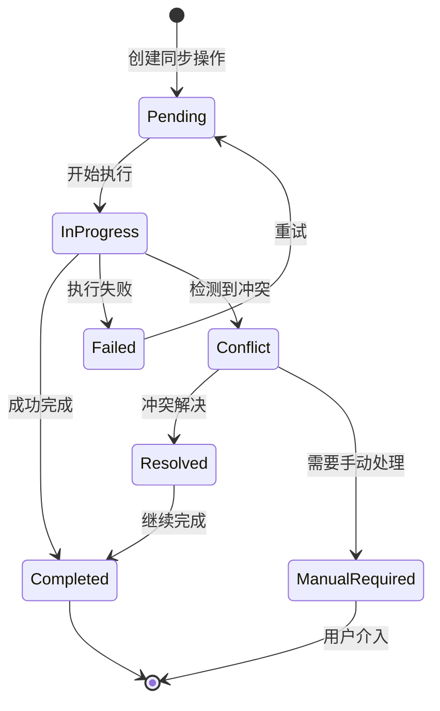

# 多 Provider 数据存储架构设计

## 概述

当前架构将所有 Provider 的数据混合存储在同一个文件中，无法有效支持：

1. 多 Provider 独立管理
2. Provider 之间的任务同步
3. 任务来源追踪和冲突解决

## 当前架构问题

### 文件结构

```
data/
├── tasks.json      # 所有任务混合在一起
├── lists.json      # 所有列表混合在一起（仅通过 source 字段区分）
└── sync.json       # 简单的同步时间记录
```

### 问题分析

1. **数据隔离不足**：所有 Provider 的任务存储在同一文件，容易冲突
2. **同步状态简单**：仅记录最后同步时间，无详细同步状态
3. **缺乏映射关系**：无法追踪同一任务在不同 Provider 间的对应关系
4. **冲突解决困难**：没有版本控制或冲突检测机制

## 新架构设计

### 目录结构

```
data/
├── manifest.json           # 全局清单文件
├── sync-state.json         # 同步状态数据库
├── mappings.json           # 跨 Provider 任务映射
├── providers/
│   ├── google/
│   │   ├── tasks.json      # Google Tasks 原始数据
│   │   ├── lists.json      # Google Tasks 列表
│   │   └── meta.json       # 元数据（同步时间、ETag等）
│   ├── microsoft/
│   │   ├── tasks.json      # Microsoft To Do 原始数据
│   │   ├── lists.json      # Microsoft To Do 列表
│   │   └── meta.json       # 元数据
│   ├── feishu/
│   │   ├── tasks.json
│   │   ├── lists.json
│   │   └── meta.json
│   │   ├── tasks.json
│   │   ├── lists.json
│   │   └── meta.json
│   ├── ticktick/
│   │   ├── tasks.json
│   │   ├── lists.json
│   │   └── meta.json
│   └── todoist/
│       ├── tasks.json
│       ├── lists.json
│       └── meta.json
└── cache/                  # 缓存目录
    └── delta/              # 增量同步缓存
```

### 核心数据结构

#### manifest.json - 全局清单

```json
{
  "version": "1.0",
  "created_at": "2026-02-23T09:00:00+08:00",
  "updated_at": "2026-02-23T09:30:00+08:00",
  "providers": {
    "google": {
      "enabled": true,
      "authenticated": true,
      "last_sync": "2026-02-23T09:00:00+08:00",
      "task_count": 45,
      "list_count": 10
    },
    "microsoft": {
      "enabled": true,
      "authenticated": true,
      "last_sync": "2026-02-23T08:30:00+08:00",
      "task_count": 30,
      "list_count": 5
    }
  },
  "sync_pairs": [
    { "source": "google", "target": "microsoft", "enabled": true },
    { "source": "google", "target": "feishu", "enabled": false }
  ]
}
```

#### providers/{provider}/meta.json - Provider 元数据

```json
{
  "provider": "microsoft",
  "display_name": "Microsoft To Do",
  "last_full_sync": "2026-02-23T09:00:00+08:00",
  "last_delta_sync": "2026-02-23T09:30:00+08:00",
  "sync_token": "AQD...==",
  "etag": "W/\"JzQ0...\"",
  "capabilities": {
    "supports_delta": false,
    "supports_subtasks": true,
    "supports_priority": true,
    "supports_tags": false,
    "supports_reminders": true
  },
  "stats": {
    "total_tasks": 30,
    "completed_tasks": 10,
    "pending_tasks": 20,
    "lists": 5
  }
}
```

#### sync-state.json - 同步状态数据库

```json
{
  "version": "1.0",
  "sync_sessions": [
    {
      "id": "sync_20260223_090000",
      "direction": "pull",
      "source": "microsoft",
      "started_at": "2026-02-23T09:00:00+08:00",
      "completed_at": "2026-02-23T09:00:05+08:00",
      "status": "completed",
      "stats": {
        "pulled": 30,
        "updated": 5,
        "skipped": 25,
        "errors": 0
      }
    }
  ],
  "pending_operations": [
    {
      "id": "op_001",
      "type": "create",
      "provider": "google",
      "task_id": "local_123",
      "created_at": "2026-02-23T09:15:00+08:00",
      "retries": 0,
      "status": "pending"
    }
  ]
}
```

#### mappings.json - 跨 Provider 任务映射

```json
{
  "version": "1.0",
  "mappings": [
    {
      "local_id": "task_abc123",
      "title_hash": "sha256:abc123...",
      "providers": {
        "google": {
          "id": "MTQzMzM0MTg4ODg3NzMwODk0MTc6MDow",
          "list_id": "eWpLNWZhTHhuNV80Y2dRWQ",
          "etag": "W/\"JzQ0...\"",
          "last_modified": "2026-02-23T08:00:00Z",
          "version": 3
        },
        "microsoft": {
          "id": "AQMkADAwATMwMAItMzU2AC0zMDNmLTAwMA==",
          "list_id": "AQMkADAwATMwMAItMzU2AC0zMDNmLTAwMA==",
          "etag": "\"{CQAAABY...}\"",
          "last_modified": "2026-02-23T08:05:00Z",
          "version": 2
        }
      },
      "sync_status": "synced",
      "last_sync": "2026-02-23T09:00:00+08:00",
      "conflict_resolution": "latest_wins"
    }
  ]
}
```

### 任务数据结构增强

#### providers/{provider}/tasks.json

```json
[
  {
    "id": "AQMkADAwATMwMAItMzU2AC0zMDNmLTAwMA==",
    "list_id": "AQMkADAwATMwMAItMzU2AC0zMDNmLTAwMA==",
    "title": "完成项目报告",
    "description": "Q1季度项目总结报告",
    "status": "pending",
    "priority": 1,
    "due_date": "2026-02-25T18:00:00Z",
    "reminder": "2026-02-25T09:00:00Z",
    "created_at": "2026-02-20T10:00:00Z",
    "updated_at": "2026-02-23T08:00:00Z",
    "completed_at": null,
    "etag": "\"{CQAAABY...}\"",
    "raw_data": {
      // 原始 API 响应数据
      "@odata.context": "https://graph.microsoft.com/v1.0/$metadata...",
      "@odata.etag": "W/\"CQAAABYAAAB...\"",
      "importance": "high",
      "isReminderOn": true
    }
  }
]
```

## 同步机制设计

### 同步流程

```mermaid
flowchart TD
    subgraph Pull[拉取同步 Pull]
        A[开始 Pull] --> B[获取远程任务列表]
        B --> C{本地存在?}
        C -->|是| D[比较 ETag/版本]
        C -->|否| E[创建新任务]
        D --> F{有变化?}
        F -->|是| G[更新本地任务]
        F -->|否| H[跳过]
        E --> I[更新映射表]
        G --> I
        H --> J[下一个任务]
        I --> J
        J --> K{还有更多?}
        K -->|是| B
        K -->|否| L[保存同步状态]
    end

    subgraph Push[推送同步 Push]
        M[开始 Push] --> N[获取本地变更]
        N --> O{变更类型?}
        O -->|新建| P[创建远程任务]
        O -->|更新| Q[更新远程任务]
        O -->|删除| R[删除远程任务]
        P --> S[更新映射表]
        Q --> S
        R --> T[删除映射]
        S --> U[保存同步状态]
        T --> U
    end

    subgraph Bidirectional[双向同步]
        V[开始双向同步] --> W[Pull 阶段]
        W --> X[冲突检测]
        X --> Y{有冲突?}
        Y -->|是| Z[冲突解决]
        Y -->|否| AA[Push 阶段]
        Z --> AA
        AA --> AB[完成]
    end
```



### 冲突解决策略

```go
type ConflictResolution string

const (
    ConflictLatestWins    ConflictResolution = "latest_wins"    // 最新修改优先
    ConflictSourceWins    ConflictResolution = "source_wins"    // 源优先
    ConflictTargetWins    ConflictResolution = "target_wins"    // 目标优先
    ConflictManual        ConflictResolution = "manual"         // 手动解决
    ConflictKeepBoth      ConflictResolution = "keep_both"      // 保留两者
)
```

### 同步状态机



## Provider 间同步

### 同步对配置

```yaml
# config.yaml
sync_pairs:
  - source: google
    target: microsoft
    enabled: true
    direction: bidirectional
    conflict_resolution: latest_wins
    field_mapping:
      # 字段映射（当字段名称不同时）
      google_priority: microsoft_importance
    filters:
      # 同步过滤规则
      - field: list_name
        pattern: "工作*"
        action: include
      - field: status
        value: completed
        action: exclude
```

### 同步命令增强

```bash
# 从单个 Provider 拉取
taskbridge sync pull ms
taskbridge sync pull google

# 推送到单个 Provider
taskbridge sync push ms

# 双向同步单个 Provider
taskbridge sync bidirectional ms

# 同步两个 Provider 之间
taskbridge sync between google ms

# 同步所有已配置的 Provider 对
taskbridge sync all

# 查看同步状态
taskbridge sync status
taskbridge sync status ms

# 解决冲突
taskbridge sync resolve --list
taskbridge sync resolve <conflict_id> --strategy latest_wins
```

## 实现计划

### 阶段一：存储重构

1. 实现新的目录结构
2. 创建数据迁移工具
3. 更新 FileStorage 接口

### 阶段二：映射系统

1. 实现任务映射表
2. 创建 ID 生成和映射逻辑
3. 实现 ETag/版本追踪

### 阶段三：同步引擎

1. 实现增量同步
2. 添加冲突检测
3. 实现冲突解决策略

### 阶段四：命令增强

1. 添加 Provider 简写支持
2. 实现新的同步命令
3. 添加冲突解决命令

## 数据迁移

从旧格式迁移到新格式的脚本：

```bash
# 自动迁移
taskbridge migrate

# 检查迁移状态
taskbridge migrate status

# 回滚迁移
taskbridge migrate rollback
```

## 兼容性

- 保持向后兼容旧的 `tasks.json` 格式
- 首次运行时自动迁移数据
- 支持只读模式访问旧数据
