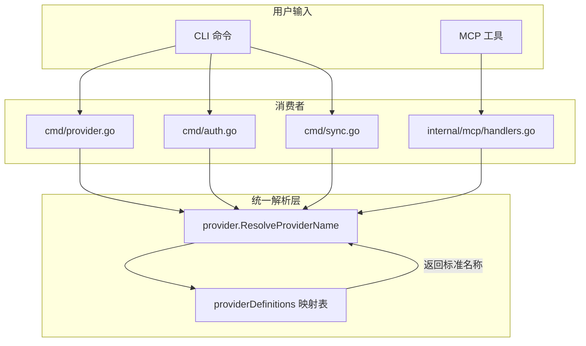

# Provider 名称统一解析方案

## 问题描述

当前项目中 Provider 名称解析存在以下问题：

1. **简写解析不一致**：
   - `taskbridge provider info ms` 不工作（必须使用 `microsoft`）
   - `taskbridge sync pull ms` 可以工作
   - MCP 工具支持简写，但 CLI 命令不支持

2. **代码重复**：
   - [`cmd/sync.go:19-35`](cmd/sync.go:19) 有 `providerAliases` 和 `resolveProviderName`
   - [`internal/mcp/handlers.go:1216-1233`](internal/mcp/handlers.go:1216) 有 `resolveProviderShortName`
   - [`cmd/provider.go`](cmd/provider.go) 没有简写解析

3. **大小写敏感**：用户输入 `Microsoft` 或 `MS` 可能无法识别

## 当前实现分析

### Provider 别名定义位置

| 位置                       | 简写支持 | 别名定义                                        |
| -------------------------- | -------- | ----------------------------------------------- |
| `cmd/sync.go`              | ✅       | `ms`→microsoft, `tick`→ticktick, `todo`→todoist |
| `cmd/provider.go`          | ❌       | 无                                              |
| `cmd/auth.go`              | ❌       | 无                                              |
| `internal/mcp/handlers.go` | ✅       | 同 sync.go                                      |

### 支持的 Provider 列表

| 完整名称  | 简写   | 显示名称        |
| --------- | ------ | --------------- |
| google    | google | Google Tasks    |
| microsoft | ms     | Microsoft To Do |
| feishu    | feishu | 飞书任务        |
| ticktick  | tick   | TickTick        |
| todoist   | todo   | Todoist         |

## 解决方案

### 1. 创建统一的 Provider 解析模块

在 `internal/provider/` 目录下创建新文件 `resolver.go`：

```go
package provider

import "strings"

// ProviderDefinition 定义 Provider 的完整信息
type ProviderDefinition struct {
    Namestring// 标准名称（小写）
    ShortName   string// 简写
    DisplayName string// 显示名称
    Aliases     []string // 额外别名（包括大小写变体）
}

// providerDefinitions 所有支持的 Provider 定义
var providerDefinitions = map[string]ProviderDefinition{
    "google": {
        Name:        "google",
        ShortName:   "google",
        DisplayName: "Google Tasks",
        Aliases:     []string{"google", "g"},
    },
    "microsoft": {
        Name:        "microsoft",
        ShortName:   "ms",
        DisplayName: "Microsoft To Do",
        Aliases:     []string{"microsoft", "ms", "MS", "Microsoft"},
    },
    "feishu": {
        Name:        "feishu",
        ShortName:   "feishu",
        DisplayName: "飞书任务",
        Aliases:     []string{"feishu", "飞书"},
    },
    },
    "ticktick": {
        Name:        "ticktick",
        ShortName:   "tick",
        DisplayName: "TickTick",
        Aliases:     []string{"ticktick", "tick", "TickTick"},
    },
    "todoist": {
        Name:        "todoist",
        ShortName:   "todo",
        DisplayName: "Todoist",
        Aliases:     []string{"todoist", "todo", "Todoist"},
    },
}

// aliasToName 别名到标准名称的映射（自动生成）
var aliasToName map[string]string

func init() {
    aliasToName = make(map[string]string)
    for _, def := range providerDefinitions {
        // 添加标准名称
        aliasToName[strings.ToLower(def.Name)] = def.Name
        // 添加所有别名
        for _, alias := range def.Aliases {
            aliasToName[strings.ToLower(alias)] = def.Name
        }
    }
}

// ResolveProviderName 将任意形式的 Provider 名称解析为标准名称
// 支持简写、全称、大小写不敏感
func ResolveProviderName(name string) string {
    resolved, ok := aliasToName[strings.ToLower(name)]
    if ok {
        return resolved
    }
    return name // 返回原始名称，让调用方处理未知 Provider
}

// GetProviderDefinition 获取 Provider 定义
func GetProviderDefinition(name string) (ProviderDefinition, bool) {
    standardName := ResolveProviderName(name)
    def, ok := providerDefinitions[standardName]
    return def, ok
}

// GetAllProviders 获取所有 Provider 定义
func GetAllProviders() []ProviderDefinition {
    result := make([]ProviderDefinition, 0, len(providerDefinitions))
    for _, name := range order {
        if def, ok := providerDefinitions[name]; ok {
            result = append(result, def)
        }
    }
    return result
}

// IsValidProvider 检查是否是有效的 Provider 名称
func IsValidProvider(name string) bool {
    standardName := ResolveProviderName(name)
    _, ok := providerDefinitions[standardName]
    return ok
}
```

### 2. 更新各模块使用统一解析

#### cmd/provider.go

```go
import "github.com/yeisme/taskbridge/internal/provider"

func runProviderInfo(cmd *cobra.Command, args []string) {
    providerName := provider.ResolveProviderName(args[0])
    // ... 后续逻辑
}
```

#### cmd/auth.go

```go
func runAuthLogin(cmd *cobra.Command, args []string) {
    providerName := provider.ResolveProviderName(args[0])
    switch providerName {
    case "google":
        loginGoogle()
    case "microsoft":
        loginMicrosoft()
    // ...
    }
}
```

#### cmd/sync.go

移除本地的 `providerAliases` 和 `resolveProviderName`，改用：

```go
import "github.com/yeisme/taskbridge/internal/provider"

// 删除本地的 providerAliases 和 resolveProviderName

func runSyncPull(cmd *cobra.Command, args []string) {
    providerName := provider.ResolveProviderName(args[0])
    // ...
}
```

#### internal/mcp/handlers.go

移除本地的 `resolveProviderShortName`，改用：

```go
import "github.com/yeisme/taskbridge/internal/provider"

// 删除本地的 resolveProviderShortName

func (s *Server) handleGetProviderInfo(ctx context.Context, req *mcp.CallToolRequest) (*mcp.CallToolResult, error) {
    // ...
    providerName := provider.ResolveProviderName(params.Provider)
    // ...
}
```

## 架构图



## 支持的输入格式

修复后，以下所有输入格式都将正确识别：

| 用户输入                             | 解析结果    |
| ------------------------------------ | ----------- |
| `google`, `Google`, `GOOGLE`, `g`    | `google`    |
| `microsoft`, `Microsoft`, `MS`, `ms` | `microsoft` |
| `feishu`, `Feishu`, `飞书`           | `feishu`    |
| `ticktick`, `TickTick`, `tick`       | `ticktick`  |
| `todoist`, `Todoist`, `todo`         | `todoist`   |

## 实施步骤

1. 创建 [`internal/provider/resolver.go`](internal/provider/resolver.go)
2. 更新 [`cmd/provider.go`](cmd/provider.go) 使用 `provider.ResolveProviderName`
3. 更新 [`cmd/auth.go`](cmd/auth.go) 使用 `provider.ResolveProviderName`
4. 更新 [`cmd/sync.go`](cmd/sync.go) 删除本地解析代码，使用统一模块
5. 更新 [`internal/mcp/handlers.go`](internal/mcp/handlers.go) 删除本地解析代码
6. 运行测试确保所有命令正常工作

## 测试验证

修复后应验证以下命令：

```bash
# provider 命令 - 简写和全称都应工作
taskbridge provider info ms
taskbridge provider info microsoft
taskbridge provider info Microsoft
taskbridge provider enable tick
taskbridge provider test todo

# auth 命令
taskbridge auth login ms
taskbridge auth login microsoft
taskbridge auth refresh google
taskbridge auth refresh g

# sync 命令
taskbridge sync pull ms
taskbridge sync push microsoft
taskbridge sync bidirectional tick
```
