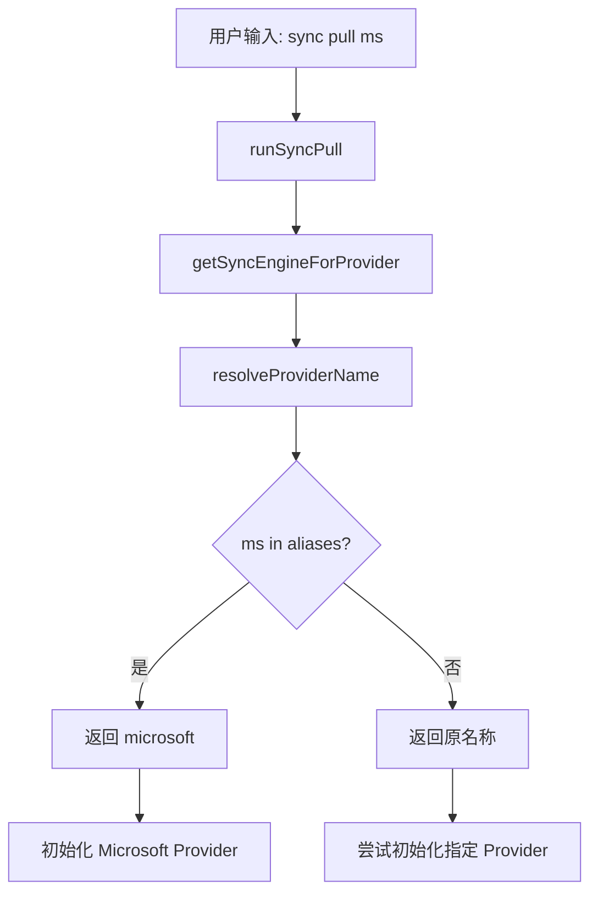

# Sync 命令支持 Provider 简写

## 问题描述

当前 `sync pull/push` 命令只支持完整的 provider 名称（如 `microsoft`），不支持简写（如 `ms`）。

```bash
# 当前可用
taskbridge sync pull microsoft

# 期望也能使用简写
taskbridge sync pull ms
```

## 现状分析

### 简写定义位置

在 [`cmd/provider.go:98-148`](cmd/provider.go:98) 中定义了 provider 信息，包含简写：

```go
func getProviderInfos() map[string]ProviderInfo {
    return map[string]ProviderInfo{
        "microsoft": {
            Name:        "microsoft",
            ShortName:   "ms",  // 简写定义
            DisplayName: "Microsoft To Do",
            // ...
        },
        "ticktick": {
            ShortName:   "tick",  // 简写定义
            // ...
        },
        "todoist": {
            ShortName:   "todo",  // 简写定义
            // ...
        },
        // ...
    }
}
```

### 问题位置

在 [`cmd/sync.go:137-184`](cmd/sync.go:137) 的 `getSyncEngineForProvider` 函数中，只检查完整名称：

```go
func getSyncEngineForProvider(providerName string) (*sync.Engine, error) {
    // ...

    // 初始化 Microsoft Provider
    if providerName == "" || providerName == "microsoft" {  // 只检查 "microsoft"，不检查 "ms"
        // ...
    }
    // ...
}
```

## 解决方案

### 方案一：添加 resolveProviderName 函数（推荐）

在 `cmd/sync.go` 中添加一个名称解析函数，将简写转换为完整名称：

```go
// providerAliases provider 简写到完整名称的映射
var providerAliases = map[string]string{
    "ms":      "microsoft",
    "tick":    "ticktick",
    "todo":    "todoist",
    "google":  "google",
    "feishu":  "feishu",
}

// resolveProviderName 将 provider 名称或简写解析为完整名称
func resolveProviderName(name string) string {
    if fullName, ok := providerAliases[name]; ok {
        return fullName
    }
    return name
}
```

然后在 `getSyncEngineForProvider` 函数开头调用：

```go
func getSyncEngineForProvider(providerName string) (*sync.Engine, error) {
    providerName = resolveProviderName(providerName)
    // ... 其余代码不变
}
```

### 方案二：复用 getProviderInfos 函数

从 `cmd/provider.go` 中提取简写映射逻辑，创建共享函数：

```go
// GetProviderFullName 根据 name 或 shortName 获取完整 provider 名称
func GetProviderFullName(name string) string {
    providers := getProviderInfos()

    // 先检查是否是完整名称
    if _, ok := providers[name]; ok {
        return name
    }

    // 再检查是否是简写
    for fullName, info := range providers {
        if info.ShortName == name {
            return fullName
        }
    }

    return name
}
```

## 推荐方案

**推荐方案一**，原因：

1. 实现简单，代码改动最小
2. 性能更好（不需要遍历 map）
3. 易于维护

## 实现步骤

1. 在 `cmd/sync.go` 中添加 `providerAliases` 映射
2. 添加 `resolveProviderName` 函数
3. 在 `getSyncEngineForProvider` 函数开头调用 `resolveProviderName`
4. 更新命令帮助文档，说明支持简写

## 影响范围

- `cmd/sync.go` - 主要修改文件
- 其他使用 provider 名称的命令（如 `auth`、`provider`）可能也需要类似处理

## 测试用例

```bash
# 测试简写
taskbridge sync pull ms
taskbridge sync push ms
taskbridge sync bidirectional ms

# 测试完整名称（确保向后兼容）
taskbridge sync pull microsoft

# 测试其他 provider 简写
taskbridge sync pull tick  # TickTick
taskbridge sync pull todo  # Todoist
```

## 架构图


